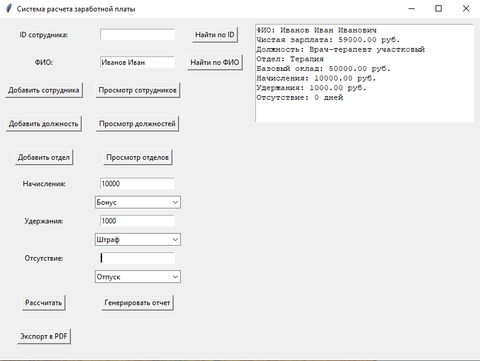

# 💰 Payroll App — Система расчёта заработной платы

## 📌 Описание
Клиент-серверное приложение для автоматизации расчёта заработной платы сотрудников. 
Состоит из серверной части (REST API), клиентского приложения с графическим интерфейсом 
и базы данных PostgreSQL.

## 🏗 Архитектура проекта
```text
payroll_app/
├── client/              # Клиентская часть (GUI)
│   ├── main.py          # Точка входа клиента
│   ├── ui.py            # Графический интерфейс
│   └── шрифты DejaVuSans
├── server/              # Серверная часть (API)
│   ├── app.py           # Основной файл сервера
│   ├── business_logic.py # Бизнес-логика
│   └── db_connector.py  # Работа с БД
├── database/            # Скрипты БД
│   ├── create_tables.sql
│   └── insert_data.sql
├──requirements.txt     # Зависимости Python
└── assets/
    └── screenshot.png  # Скриншот программы
```

## ✨ Возможности

### **Управление сотрудниками:**
-  **Поиск сотрудника по ID** — быстрый поиск с отображением информации
-  **Поиск по ФИО сотрудника** - поиск по фамилии имени или отчеству сотрудника
-  **Добавление нового сотрудника** — с указанием ФИО, должности и отдела
-  **Просмотр всех сотрудников** — табличный список с основными данными
-  **Управление должностями** — добавление новых должностей с указанием оклада
-  **Просмотр всех должностей** — табличный список с основными данными
-  **Управление отделами** — создание новых отделов
-  **Просмотр всех отделов** — табличный список с основными данными

### **Расчёт заработной платы:**
-  **Начисления** — бонусы, премии, компенсации (с выбором типа)
-  **Удержания** — налоги, штрафы, вычеты (с выбором типа)
-  **Отсутствие** — учёт дней отпуска, больничного, прогулов
-  **Автоматический расчёт** — чистая зарплата с учётом всех факторов
-  **Детальная информация** — отображение всех компонентов расчёта

### **Отчётность:**
-  **Генерация отчётов** — по периодам с общей суммой выплат
-  **Экспорт в PDF** — сохранение расчёта с красивым форматированием
-  **Поддержка кириллицы** — шрифт DejaVuSans для русских символов

## 🚀 Установка и запуск

### **1. Установка зависимостей**

```bash
pip install -r requirements.txt
```

## Настройка базы данных PostgreSQL
1. Установите PostgreSQL (если не установлен)
2. Создайте базу данных:

sql
CREATE DATABASE payroll_db;

3. Выполните SQL-скрипты из папки database/: через pgAdmin: откройте файлы .sql и выполните их.

## Настройка подключения к БД
Откройте server/db_connector.py и укажите ваши параметры подключения:
DB_CONFIG = {
    'host': 'localhost',
    'database': 'payroll_db',
    'user': 'postgres',
    'password': 'your_password',
    'port': '5432'
}

## Запуск сервера
```bash
cd server
python app.py
```
## Запуск клиента
```bash
cd client
python main.py
```
Откроется графический интерфейс программы.

## 🛠Технологии

Backend (Сервер):
Python 3.x
Flask — веб-фреймворк
Flask-CORS — поддержка跨域 запросов
PostgreSQL — база данных
Psycopg2 — драйвер PostgreSQL

Frontend (Клиент):
Python
Tkinter — графический интерфейс
Requests — HTTP-запросы к API
FPDF — генерация PDF-отчётов

База данных:
PostgreSQL 14+
Таблицы: Employees, Positions, Departments, Accruals, Deductions

## 📖 Использование

### Поиск сотрудника:
Введите ID сотрудника (например, 1)
Нажмите кнопку "Найти"
Справа отобразится информация: ФИО, должность, отдел, оклад

### Расчёт зарплаты:
Найдите сотрудника по ID
В поле "Начисления" введите сумму (бонус, премия)
Выберите тип начисления из списка
В поле "Удержания" введите сумму (налог, штраф)
Выберите тип удержания
В поле "Отсутствие" введите количество дней
Выберите тип отсутствия (отпуск, больничный)
Нажмите "Рассчитать"
Результат отобразится с детализацией

### Экспорт в PDF:
После расчёта нажмите "Экспорт в PDF"
Выберите папку для сохранения
Файл salary_calculation.pdf сохранится с полным расчётом

### Добавление данных:
Добавить сотрудника — укажите ФИО, ID должности и ID отдела
Добавить должность — укажите название и базовую зарплату
Добавить отдел — укажите название отдела
Просмотр сотрудников — откроется таблица со всеми сотрудниками

## ## 🖼 Скриншот

